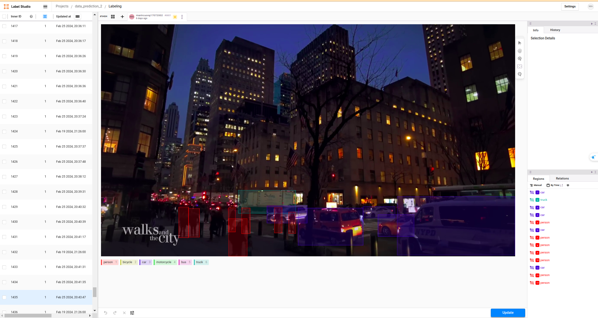

# Street-Walking-Dataset-For-Detection

Link: Coming soon

My dataset:
- We extend our gratitude to [WALKS and the CITY](https://www.youtube.com/@WALKS_and_the_CITY) channel and [Vietnam Walking Tours](https://www.youtube.com/@vietnam4kwalking) channel for providing the footage captured while walking on the streets. This dataset includes street scenes from both Hanoi and New York City.
- The dataset is annotated semi-automatically using yolov8x and label-studio, with each image extracted from the video at intervals of 180 frames.
- This dataset encompasses various weather conditions such as rain, sunshine, and nighttime scenarios.
- Annotated objects include those that are small and distant from the recording position, those visible to the naked eye when zoomed in, as well as objects displayed in full or partially obscured.
- This dataset is appropriately labeled for tasks such as detecting vehicles of various sizes, thus enhancing object detection performance, particularly for smaller objects, across different aforementioned conditions.
- The dataset comprises 6 classes: person, car, bicycle, motorcycle, bus, and truck.

