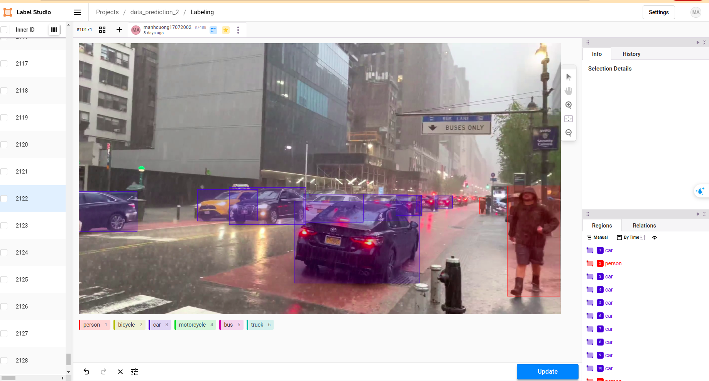
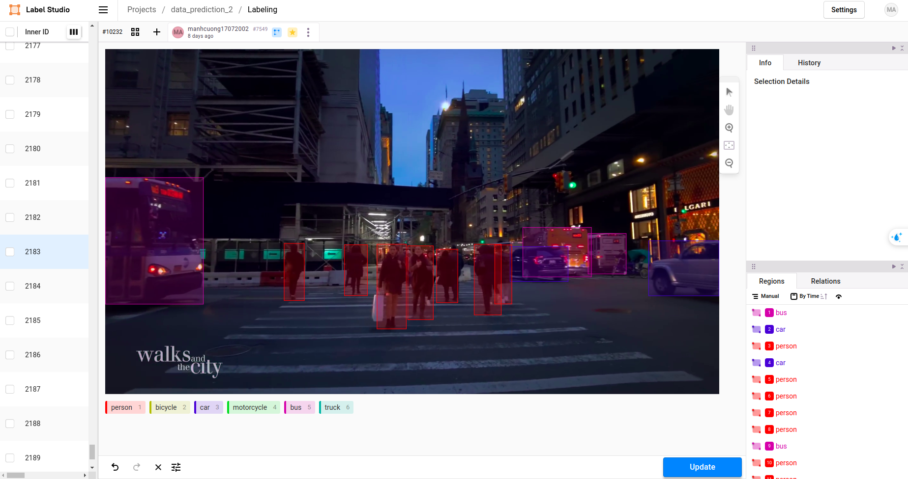
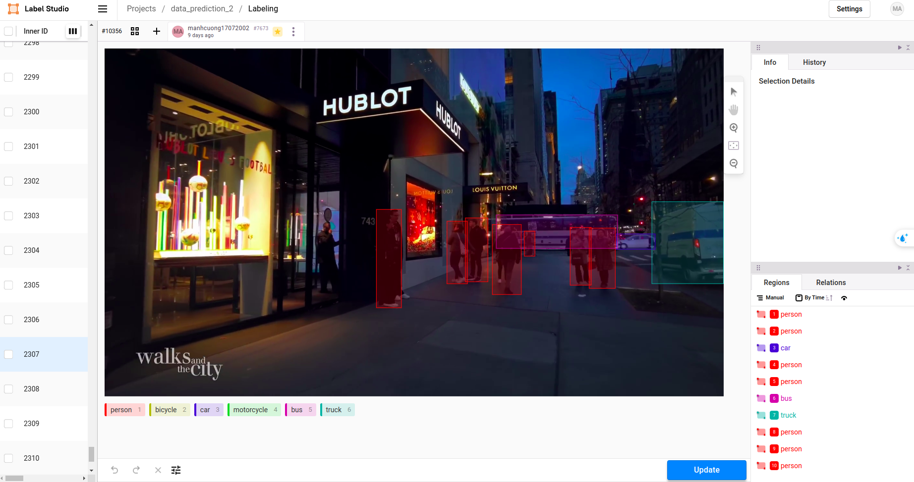

# Street-Walking-Dataset-For-Detection

## Overview
Welcome to the Street-Walking Dataset for Object Detection! This dataset offers a comprehensive collection of street scenes from two dynamic cities: Hanoi and New York City. Captured by the renowned [WALKS and the CITY](https://www.youtube.com/@WALKS_and_the_CITY) and [Vietnam Walking Tours](https://www.youtube.com/@vietnam4kwalking) channels, our dataset provides a rich resource for urban research and computer vision tasks.

## Download Link
Download the dataset [here](https://drive.google.com/file/d/18nLwBlh3OcsWDuMp9Nh6Rn9bkJ2LitTD/view?usp=sharing).

## Dataset Details
- Size: : The dataset consists of 2499 images extracted from videos provided by the two aforementioned channels. Each image is selected at intervals of 240 frames from the videos.
- Annotation: Leveraging the power of yolov8x and label-studio, the dataset is meticulously annotated, ensuring precise labeling of objects.
- Annotated Objects: The dataset covers a wide array of objects, ranging from pedestrians to various vehicles including cars, bicycles, motorcycles, buses, and trucks. Each object is annotated with utmost accuracy, capturing their presence even in challenging scenarios such as partial obstructions or distant perspectives.
- Diverse Conditions: Embracing the diversity of urban environments, the dataset encompasses different weather conditions, including rainy days, sunny weather, and nighttime scenes. This diversity ensures robust model training, enabling algorithms to adapt effectively to various environmental factors.
- Enhanced Object Detection: Designed with a focus on vehicle detection, the dataset is tailored to enhance object detection performance, particularly for smaller objects. This optimization ensures superior model performance across a wide range of conditions and scenarios.

## Use Cases
The Street-Walking Dataset for Object Detection is ideal for a multitude of research and development tasks, including:
- Pedestrian and vehicle detection
- Autonomous vehicle navigation
- Traffic monitoring and analysis
- Environmental perception for robotics

## Classes
The dataset comprises six primary classes:
- Person
- Car
- Bicycle
- Motorcycle
- Bus
- Truck

# Copyright Disclaimer for Dataset Usage
- This dataset is provided solely for educational and research purposes. All images and data contained within this dataset are protected by intellectual property rights and copyright laws. Unauthorized use, reproduction, distribution, or commercial exploitation of any part of this dataset for business, commercial, or resale purposes is strictly prohibited without prior consent from the copyright owner.

- This disclaimer emphasizes the dataset's intended use for educational and research purposes only and explicitly prohibits its use for commercial activities or resale

## Some images are labeled in Label Studio 

  
  
  
  

# Acknowledgement and Support Request

Thank you for accessing this dataset! Your interest and engagement are highly appreciated. To show your support, kindly consider starring the repository. Your support encourages ongoing development and improvement of this dataset, enabling further advancements in research and education. Thank you for your support!

